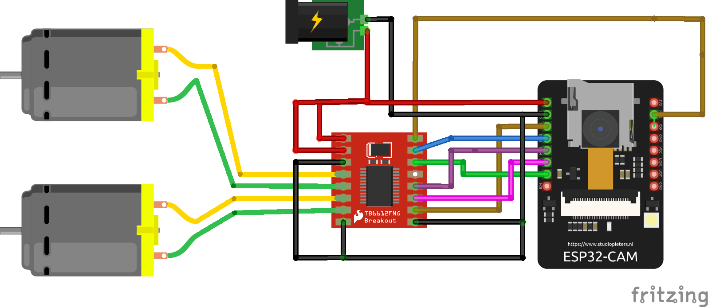

# c3RE Robot

I took some insperation from here :

1) http://www.embeddedmakers.com/projects-update/esp32-cam-robot/
2) https://github.com/c3d2/C3-PR

this part of Software is a mix of both projects.

I used PlatformIO for the development. 

## Pins

## Upload and Build
After you have build and Uploaded the code you have also to upload the indexfile of the data folder by using:

	pio run -t uploadfs
